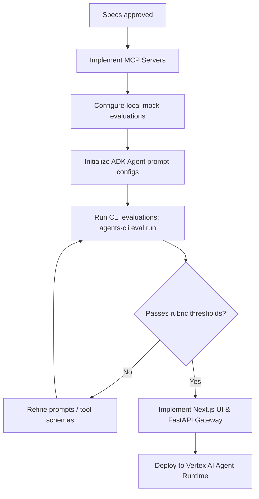

# GrowthScout AI: Business Discovery & Growth Intelligence Platform

Welcome to the **GrowthScout AI** repository. GrowthScout AI is a production-grade AI agent platform designed to help freelancers, agencies, and consultants identify local business growth opportunities, analyze SMB digital footprints, run automated SEO and stack audits, and construct bespoke growth marketing campaigns and Growth Intelligence Reports.

This repository is governed by the principles of **Spec-Driven Development (SDD)**, **Agentic Engineering**, and **Evaluation-First Development**. At this stage of the lifecycle, the repository is maintained in a **zero-implementation state**. It contains only architecture records, manifests, skill specifications, schemas, evaluation datasets, and security rule bases. No application source code exists.

---

## 🌟 Platform Principles

*   **Spec-Driven Development**: Every agent, API interface, and component must adhere to a strict specification file before development begins. The OpenAPI/Swagger blueprints, routing topologies, and data models serve as compile-time contracts.
*   **Agentic Engineering**: Orchestrators and domain agents are isolated by role. Their logic is defined through input/output contracts, specific tool permissions, and structured system instructions.
*   **Reusable Skills Architecture**: Capabilities (e.g., SEO auditing, competitor analysis) are developed as decoupled, reusable skill packages. Each package includes independent documentation, test targets, and example executions.
*   **MCP Interoperability**: External integration (e.g., Google Maps searches, business website crawling) runs via the Model Context Protocol (MCP) to decouple LLM reasoning from API connectivity.
*   **Evaluation-First Development**: Agent quality is defined by systematic evaluation datasets and LLM-as-judge rubrics. A feature is only complete when it passes validation thresholds in our evaluation harness.
*   **Security-First Development**: Guardrails, PII redaction rules, and sandboxing policies are codified first and validated on every agent execution turn.

---

## 📂 Repository Directory Layout

The repository is organized into distinct domain-driven definition folders:

```
├── README.md                      # Onboarding and repository guidelines
├── PROJECT_CONSTITUTION.md        # Governance laws and code style guidelines
├── specs/                         # Core product, system, and agent specifications
├── memory/                        # Session/Profile schemas & Memory Bank configuration
├── docs/                          # Developer guides, playbooks, and Architecture Decision Records (ADRs)
├── agents/                        # Personas, prompts, and ADK manifests for all 5 platform agents
├── skills/                        # Encapsulated, reusable skill definitions and test suites
├── mcp/                           # MCP tool schemas, API payloads, and contracts
├── workflows/                     # DAG routing maps and Human-in-the-Loop approval rules
├── eval/                          # Grading rubrics, datasets, and evaluation harnesses
└── security/                      # Input filters, permissions models, and PII masking rules
```

---

## 🚀 Execution & Implementation Flow

To transition this specification into an active service, the development workflow must follow these phases:



1.  **Read the Specifications**: Understand the multi-agent orchestration architecture in [agent_architecture.md](file:///Users/ptech/Desktop/growthscout-ai/specs/agent_architecture.md) and tool dependencies in [mcp/integration_spec.md](file:///Users/ptech/Desktop/growthscout-ai/mcp/integration_spec.md).
2.  **Inspect the Evaluation Baseline**: Review the grading configurations and datasets in [eval_config.yaml](file:///Users/ptech/Desktop/growthscout-ai/eval/eval_config.yaml) and [datasets/](file:///Users/ptech/Desktop/growthscout-ai/eval/datasets/).
3.  **Run Local CLI Audits**: Install the Google Agent Platform CLI (`uv tool install google-agents-cli`) and verify configurations via `agents-cli lint` and `agents-cli eval dataset synthesize` (in prototype mode).
4.  **Implement and Verify**: Build out Python FastAPI microservices and Next.js interfaces that bind directly to the schemas provided in [memory/](file:///Users/ptech/Desktop/growthscout-ai/memory/) and [specs/api_spec.yaml](file:///Users/ptech/Desktop/growthscout-ai/specs/api_spec.yaml).
