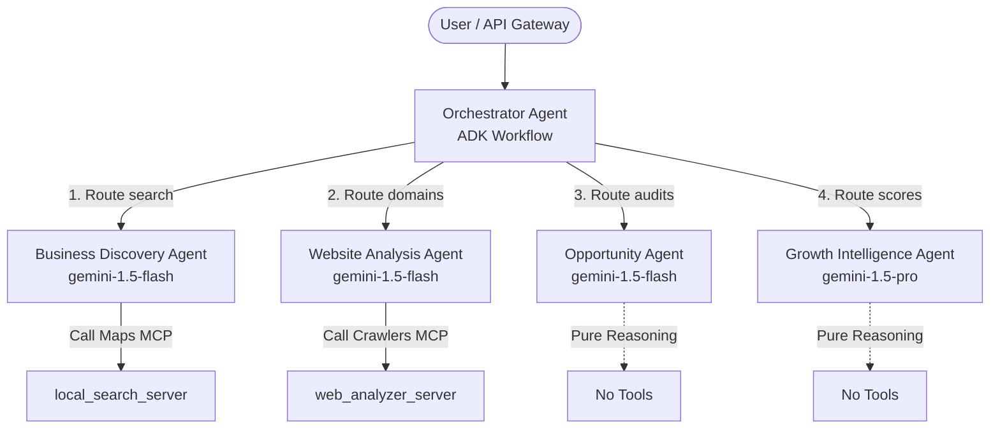
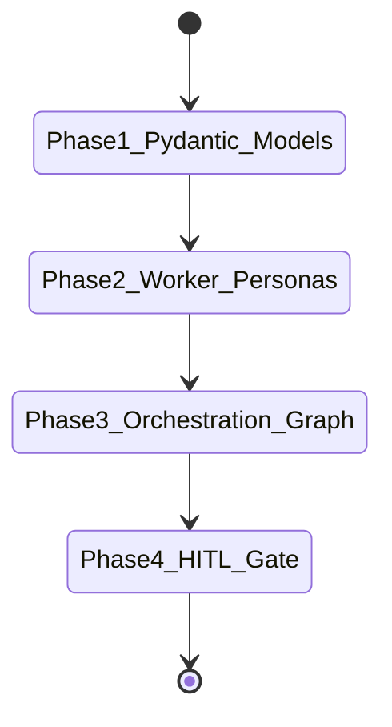

# Agent Architecture Review: GrowthScout AI

This document presents the Phase 3A Agent Architecture Review for the **GrowthScout AI** platform. It provides a formal design review of the agent boundaries, memory governance, skill ownership, MCP tool integrations, state transitions, and ADK-specific orchestration patterns before implementation begins.

---

## 1. Executive Summary & Design Governance

GrowthScout AI implements an **Orchestrator-Worker Hub-and-Spoke topology**. 
To align with the project constraints and Google Agent Development Kit (ADK) best practices, the system follows these structural governance rules:

*   **No Worker-to-Worker Calls**: Worker agents are decoupled. They have no knowledge of each other and cannot invoke other agents.
*   **Centralized State Transitions**: The orchestrator is the sole authority governing workflow state transitions and task routing.
*   **Pydantic Schema Serialization**: Every agent boundary enforces structured inputs and outputs via Pydantic schemas. 
*   **ADK 2.0 Workflow Graph**: The orchestration is implemented via the ADK 2.0 `Workflow` API, defining nodes (tasks, agents, functions) and edges (conditional routing).
*   **Zero Direct Database Access for Workers**: Worker agents execute within isolated boundaries and cannot write directly to the persistent Firestore database. They return structured outputs which the Orchestrator persists.

---

## 2. Agent Personas & Jurisdictions

Each of the five agent personas serves a distinct, non-overlapping purpose in the system:



### 2.1 Orchestrator Agent (The Coordinator)
*   **Agent Class**: Custom `Workflow` class (`google.adk.workflow.Workflow`).
*   **Jurisdiction**: Graph execution, conditional edge routing, lead partitioning logic, HITL state holding, and audit logging.
*   **Constraints**: Barred from invoking any external tools (Google Maps, crawlers) or skill logic directly. Excluded from copywriting tasks.

### 2.2 Business Discovery Agent (The Finder)
*   **Agent Class**: `LlmAgent` (`google.adk.agents.LlmAgent`).
*   **Jurisdiction**: Geographic lookup, target business matching, and competitor candidate extraction.
*   **Constraints**: Barred from crawling external websites, calculating opportunity scores, or writing marketing copy.

### 2.3 Website Analysis Agent (The Auditor)
*   **Agent Class**: `LlmAgent` (`google.adk.agents.LlmAgent`).
*   **Jurisdiction**: Crawling page content, detecting CMS/widgets, and extracting on-page SEO fields.
*   **Constraints**: Barred from querying Maps, executing competitor comparisons, or drafting emails. Enforces robots.txt verification.

### 2.4 Opportunity Agent (The Strategist)
*   **Agent Class**: `LlmAgent` (`google.adk.agents.LlmAgent`).
*   **Jurisdiction**: Categorizing gaps into the 8 Opportunity Categories, mapping bugs to business impacts, and calculating Opportunity Scores with confidence degradation logic.
*   **Constraints**: Pure reasoning agent. Barred from tool executions (no internet access, no database write access). Must remain 100% grounded in crawler outputs.

### 2.5 Growth Intelligence Agent (The Copywriter)
*   **Agent Class**: `LlmAgent` (`google.adk.agents.LlmAgent`).
*   **Jurisdiction**: Report synthesis (Markdown Growth Intelligence Report) and campaign copywriting (outreach drafts, proposals).
*   **Constraints**: Pure reasoning agent. Excluded from performing audits or generating scores. Output must strictly reflect the opportunity scores.

---

## 3. Agent Ownership & Access Matrices

### 3.1 Task Ownership Matrix

| Workflow State | Task Name | Responsible Agent | Output Schema |
| :--- | :--- | :--- | :--- |
| `DISCOVERING` | Local Lead Search | `business_discovery_agent` | `DiscoveryLeadsSchema` |
| `LEAD_PARTITIONING` | Split leads by URL availability | `orchestrator_agent` (Function) | `LeadPartitionSchema` |
| `AUDITING` | Parallel Website Audits | `website_analysis_agent` | `AuditResultsSchema` |
| `OPPORTUNITY_ANALYSIS` | Gap Classification & Scoring | `opportunity_agent` | `OpportunityAnalysisSchema` |
| `REPORT_GENERATION` | Compile GI Report & Outreach | `growth_intelligence_agent` | `GrowthReportsSchema` |
| `AWAITING_APPROVAL` | Halt & Wait for human callback | `orchestrator_agent` (HITL Gate) | `ApprovalCallbackPayload` |

### 3.2 Memory Access Matrix
Memory boundaries are protected via read-write permission settings:

| Memory Domain | Orchestrator Agent | Discovery Agent | Analysis Agent | Opportunity Agent | Growth Intel Agent |
| :--- | :---: | :---: | :---: | :---: | :---: |
| `session_memory` (ephemeral) | **Read / Write** | **Read / Write** | **Read / Write** | Read Only | Read Only |
| `business_profiles` | **Read / Write** | Append Only | Denied | Read Only | Read Only |
| `audit_history` | **Read / Write** | Denied | Append Only | Read Only | Read Only |
| `opportunity_history` | **Read / Write** | Denied | Denied | Append Only | Read Only |
| `competitor_snapshots` | **Read / Write** | Denied | Denied | **Read / Write** | Read Only |
| `human_notes` | **Read / Write** | Denied | Denied | Denied | Read Only |
| `growth_reports` | **Read / Write** | Denied | Denied | Denied | Append Only |

### 3.3 Skill Access Matrix

| Skill Package | Discovery Agent | Analysis Agent | Opportunity Agent | Growth Intel Agent | Orchestrator |
| :--- | :---: | :---: | :---: | :---: | :---: |
| `business-discovery` | **Bound** | Excluded | Excluded | Excluded | Excluded |
| `local-business-research` | **Bound** | Excluded | Excluded | Excluded | Excluded |
| `website-analysis` | Excluded | **Bound** | Excluded | Excluded | Excluded |
| `seo-audit` | Excluded | **Bound** | Excluded | Excluded | Excluded |
| `competitor-analysis` | Excluded | Excluded | **Bound** | Excluded | Excluded |
| `opportunity-classification` | Excluded | Excluded | **Bound** | Excluded | Excluded |
| `opportunity-scoring` | Excluded | Excluded | **Bound** | Excluded | Excluded |
| `business-impact-analysis` | Excluded | Excluded | **Bound** | Excluded | Excluded |
| `growth-report-generation` | Excluded | Excluded | Excluded | **Bound** | Excluded |
| `outreach-generation` | Excluded | Excluded | Excluded | **Bound** | Excluded |

---

## 4. MCP Server Access Controls

Worker agents are granted access only to the MCP tools declared in their manifests. Under no circumstances may an agent invoke unauthorized endpoints:

```
        ┌────────────────────────────────────────────────────────┐
        │                 FastAPI Gateway (Host)                 │
        │               Provides MCP Client Session              │
        └──────────────┬──────────────────────────┬──────────────┘
                       │                          │
          [STDIO Transport]            [STDIO Transport]
                       ▼                          ▼
        ┌──────────────────────┐   ┌──────────────────────┐
        │  local_search_server │   │  web_analyzer_server │
        │                      │   │                      │
        │ - local_business_    │   │ - web_page_fetcher   │
        │   search             │   │ - tech_footprint_    │
        │                      │   │   scanner            │
        │                      │   │ - seo_auditor        │
        └──────────────────────┘   └──────────────────────┘
```

*   **Business Discovery Agent**: Granted access ONLY to `local_search_server` -> `local_business_search`.
*   **Website Analysis Agent**: Granted access ONLY to `web_analyzer_server` -> `web_page_fetcher`, `tech_footprint_scanner`, `seo_auditor`.
*   **Opportunity Agent / Growth Intel Agent**: Granted **no** tool access (pure reasoning).

---

## 5. State Transition & Control Flow Validation

The central routing engine maps to `workflows/workflow_routing.yaml`. The state machine implements three core validation loops:

```
                                  ┌─────────────┐
                                  │    IDLE     │
                                  └──────┬──────┘
                                         │ Start
                                         ▼
                                  ┌─────────────┐
                                  │ DISCOVERING │
                                  └──────┬──────┘
                                         │ Leads Found
                                         ▼
                                  ┌─────────────┐
                                  │ PARTITION   │
                                  └──────┬──────┘
                                         │
                        ┌────────────────┴────────────────┐
                        │ Website Leads                   │ No Website Leads
                        ▼                                 │
                 ┌─────────────┐                          │
                 │  AUDITING   │                          │
                 └──────┬──────┘                          │
                        │                                 │
                        └────────────────┬────────────────┘
                                         ▼
                              ┌─────────────────────┐
                              │ OPPORTUNITY_ANALY.. │
                              └──────────┬──────────┘
                                         │
                                         ▼
                              ┌─────────────────────┐
                              │  REPORT_GENERATION  │◄────────────────┐
                              └──────────┬──────────┘                 │
                                         │                            │ Rejection (Feedback)
                                         ▼                            │
                              ┌─────────────────────┐                 │
                              │  AWAITING_APPROVAL  ├─────────────────┘
                              └──────────┬──────────┘
                                         │ Approval
                                         ▼
                              ┌─────────────────────┐
                              │      COMPLETED      │
                              └─────────────────────┘
```

### 5.1 No-Website Branch Routing
If all discovered leads lack websites, the Orchestrator bypasses the `AUDITING` state entirely. 
*   **Transition Condition**: `len(state.website_leads) == 0 and len(state.no_website_leads) > 0`
*   **Routing Action**: Jump directly from `LEAD_PARTITIONING` to `OPPORTUNITY_ANALYSIS`.
*   **Grounding Directive**: The Opportunity Agent is restricted to the "No Website Opportunity" category and must not attempt audits.

### 5.2 Human-in-the-Loop Rejection Loop
When the human reviewer rejects a compiled report draft:
1.  The Orchestrator captures `reviewer_feedback` and writes it to the `human_notes` domain.
2.  The Orchestrator increments the `revision_count` variable.
3.  The Orchestrator routes the execution back to `REPORT_GENERATION`.
4.  The Growth Intelligence Agent pulls the feedback, compiles the updated report version, and transitions back to `AWAITING_APPROVAL`.
5.  If `revision_count >= 5`, the Orchestrator aborts the session, transitioning to `FAILED` with `maximum_revision_cycles_exceeded`.

### 5.3 Evidence Validation Gate
Before calculating Opportunity Scores, the Opportunity Agent validates that:
*   Verified audit logs exist in `audit_history` for all website leads.
*   Tool execution IDs are present for trace checks.
*   If evidence is missing, the **Confidence Degradation Rules** are triggered. If core evidence is missing, the analysis is aborted to protect against hallucinations.

---

## 6. Agent Evaluation Plan

Each agent persona is tested against dedicated evaluation datasets using the Agent Platform Evaluation Service. Persona and content assertions are forbidden in `pytest` and evaluated strictly via LLM-as-judge metrics.

| Target Agent | Dataset Reference | Primary Metric | Threshold | Key Assertion |
| :--- | :--- | :--- | :---: | :--- |
| `orchestrator_agent` | `eval/datasets/workflow_test_dataset.json` | `multi_turn_trajectory_quality` | 0.90 | Trajectory follows correct sequence and handles partitions. |
| `business_discovery_agent` | `eval/datasets/discovery_dataset.json` | `multi_turn_tool_use_quality` | 0.90 | Coordinates local business searches without bypasses. |
| `website_analysis_agent` | `eval/datasets/analysis_dataset.json` | `hallucination` | <= 0.05 | Reports CMS, SEO, and speeds strictly matching page content. |
| `opportunity_agent` | `eval/datasets/opportunity_scoring_dataset.json` | `final_response_quality` | 0.85 | Opportunity categories and scores match domain rules. |
| `growth_intelligence_agent` | `eval/datasets/recommendation_dataset.json` | `final_response_quality` | 0.88 | Copy follows AIDA and cites source evidence accurately. |

---

## 7. ADK Python Implementation Order

Implementation of the agent layer will follow a strict bottom-up order, ensuring that workers are validated before the orchestration graph is wired:



### Phase 1: Pydantic Schema Declarations
*   **Task**: Implement shared models and converters mappingFirestore state schemas to skill parameters inside `utils/schema_integration/`.
*   **Verification**: Run converter test suite (`pytest tests/schema_tests/`).

### Phase 2: Worker Agent Personas
*   **Task**: Instantiate `LlmAgent` templates for the four workers (`business_discovery_agent`, `website_analysis_agent`, `opportunity_agent`, `growth_intelligence_agent`).
*   **Action**:
    *   Bind system prompts, safety directives, model types, and token limits.
    *   Bind tools and MCP toolsets.
    *   Set `output_schema` on reasoning worker agents to enforce structured output.
*   **Verification**: Run individual agent evaluations (`agents-cli eval run --dataset <agent_dataset>`).

### Phase 3: Orchestration Workflow Graph
*   **Task**: Implement the main orchestrator agent as an ADK 2.0 `Workflow` graph.
*   **Action**:
    *   Register node functions (`lead_partitioning_node`, audit logging, state updates).
    *   Register worker agent nodes.
    *   Define edges mapping transitions, conditions, and default fallbacks.
*   **Verification**: Execute integration tests and workflow regression runs (`agents-cli eval run --dataset workflow_test_dataset.json`).

### Phase 4: Human-in-the-Loop Gateway
*   **Task**: Configure `ResumabilityConfig` on the main ADK `App` container.
*   **Action**:
    *   Implement input request events (`RequestInput`) at the approval gate node.
    *   Wire user feedback updates and state version loops.
*   **Verification**: Execute simulated HITL regression runs (`eval/datasets/hitl_review_dataset.json`).

---

## 8. Phase 3 Roadmap

```
Phase 3A: Agent Architecture Review [CURRENT]
 └─► A. Deliver Architecture Review Report
 └─► B. Alignment on memory boundaries & access controls
 └─► C. Establish implementation order

Phase 3B: Agent Persona Implementation
 └─► A. Write Python files under agents/
 └─► B. Configure Pydantic validation decorators
 └─► C. Bind local MCP tools and configurations

Phase 3C: Workflow Orchestration & Routing
 └─► A. Code the ADK Workflow DAG in Python
 └─► B. Wire parallel scraping and partitioning logic
 └─► C. Implement audit trail logs and state managers

Phase 3D: Human-in-the-Loop Integration
 └─► A. Wire the App Resumability gateway
 └─► B. Connect rejection loops and feedback updates
 └─► C. Implement Growth Report version-control incremental updates

Phase 3E: Regression Testing and Validation
 └─► A. Run all agent evaluations
 └─► B. Validate security-policy (SSRF, SQL injection)
 └─► C. Complete Phase 3 verification report
```
