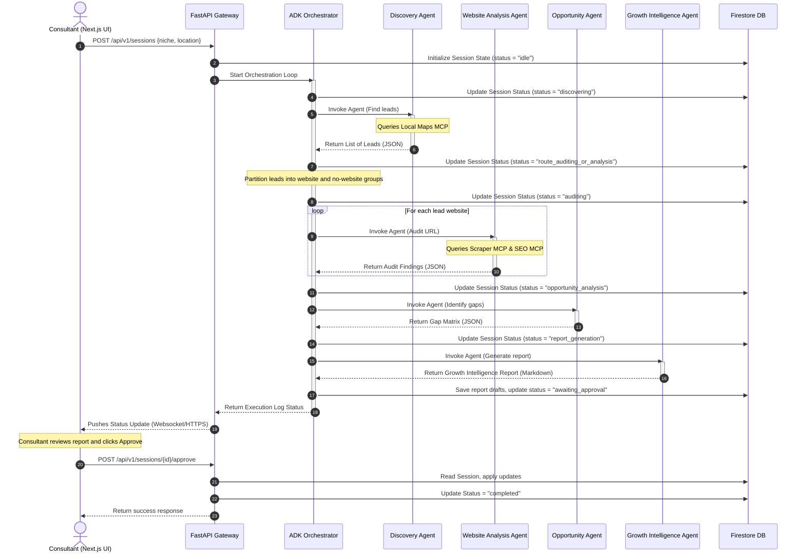

# Data Flow Specification: GrowthScout AI

This document maps the flow of data across the systems architecture during a typical business discovery, digital presence audit, and campaign proposal execution lifecycle.

---

## 1. Sequence Diagram: Core Execution Cycle



---

## 2. Shared Context Payload Structures

### Step 5: Discovery Output Format
The payload passed from the `Business Discovery Agent` back to the orchestrator:
```json
{
  "leads": [
    {
      "business_name": "Austin Boiler Experts",
      "address": "401 W 15th St, Austin, TX 78701",
      "website_url": "https://austinboilerexperts.com",
      "google_rating": 4.6,
      "review_count": 82
    }
  ]
}
```

### Step 9: Website Analysis Output Format
The payload passed from the `Website Analysis Agent` back to the orchestrator:
```json
{
  "website_url": "https://austinboilerexperts.com",
  "audit": {
    "cms": "WordPress 6.4",
    "load_time_seconds": 6.8,
    "has_analytics": false,
    "has_facebook_pixel": false,
    "has_booking_widget": false,
    "has_schema_markup": false,
    "seo": {
      "title": "Boiler Repair - Austin",
      "description": "Boiler repairs and heating services in Austin Texas.",
      "h1_elements": ["Boiler Services"]
    }
  }
}
```

### Step 13: Growth Report Output Format
The final outreach message payload generated by the `Growth Intelligence Agent`:
```json
{
  "lead_name": "Austin Boiler Experts",
  "outreach": {
    "channel": "email",
    "subject": "Quick recommendation for Austin Boiler Experts",
    "body_markdown": "Hi Team,\n\nI visited your site at https://austinboilerexperts.com and noticed that page loads take over 6 seconds on mobile devices. According to search statistics, this may be causing a bounce rate of over 50% for your local heating search traffic...\n\nWould you be open to a 10-minute audit call this week?\n\nBest,\n[Consultant]"
  }
}
```
